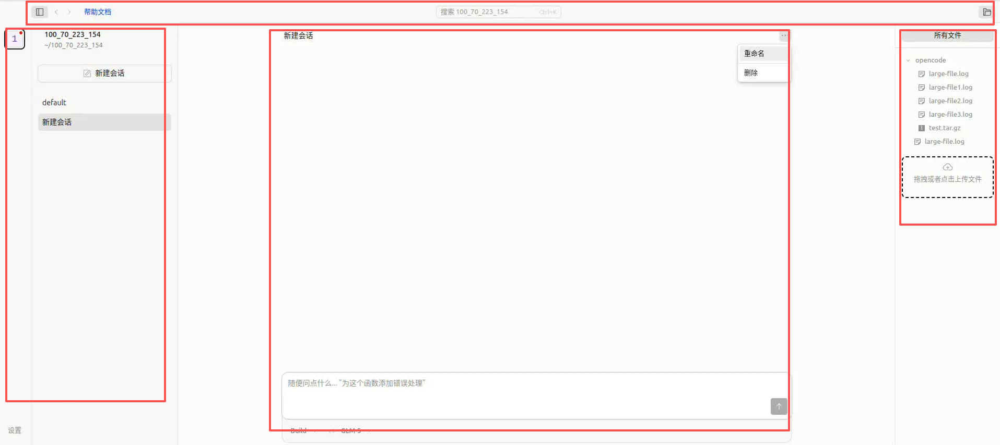

# OpenCode Web 多用户共享界面使用指南

## 概述

OpenCode Web 提供了多用户共享访问的 Web 界面，支持通过浏览器远程访问和操作项目。本文档介绍 Web 界面的主要功能和使用方法。

访问方式：`http://{服务器IP}:3000`

## 1. 界面布局

### 1.1 整体布局

界面分为四个主要区域：

- **顶部标题栏**：显示帮助文档、搜索框、切换文件树
- **左侧侧边栏**：项目列表和会话列表
- **中间主区域**：会话详情、消息时间线、输入区域
- **右侧文件树**：文件管理和上传下载

### 1.2 标题栏

顶部标题栏包含：

**左侧**：
- **帮助文档按钮**：点击打开使用指南

**中间**：
- **搜索框**：可通过会话名称搜索会话

**右侧**：
- **文件树切换按钮**：打开/关闭文件树面板

### 1.3 左侧侧边栏

左侧侧边栏包含两个部分：

**项目列表区域**：
- 只显示自己IP对应的项目

**会话列表区域**：
- 显示当前项目下的会话
- 默认显示 15 条，超过 15 条显示"加载更多"
- 显示会话标题
- 当前运行状态（工作状态会显示进度图标）

### 1.4 中间主区域

中间主区域是会话详情页面，包含：

**会话标题栏**：
- 会话名称显示
- 更多操作菜单（重命名、删除）

**消息时间线**：
- 显示对话历史
- 用户消息和 AI 回复
- 消息操作（复制、重置等）

**输入区域**：
- 底部文本输入框
- 发送消息功能
- 文件引用支持

### 1.5 右侧文件树

右侧文件树面板显示当前项目的文件结构：

**文件列表**：
- 显示上传的文件和文件夹
- 支持展开/折叠目录
- 文件图标区分文件类型

**文件操作**：
- 右键菜单（下载、删除）
- 双击引用文件到输入框

**上传区域**：
- 文件树底部的上传区域
- 支持点击上传和拖拽上传

## 2. 会话管理

### 2.1 新建会话

1. 点击会话列表区域的 **"新建会话"** 按钮
2. 在弹出的对话框中输入会话名称
3. 点击确认后自动进入新会话

### 2.2 删除会话

1. 在会话列表中找到要删除的会话
2. 鼠标悬停显示删除按钮（垃圾桶图标）
3. 点击后确认删除

**注意**：删除操作为永久删除，无法恢复，请谨慎操作。

### 2.3 会话重命名

1. 点击会话列表中的会话标题
2. 或点击右上角三点菜单选择 **"重命名"**
3. 输入新的会话名称
4. 按回车确认

### 2.4 自动会话

进入项目时如果没有指定会话 ID，系统会：
- 自动打开最近的会话
- 或创建一个名为 "default" 的默认会话

### 2.5 加载更多

会话列表默认显示最近 15 条，点击"加载更多"可查看更多历史会话。

## 3. 会话详情

### 3.1 消息时间线

会话详情页面的核心区域，显示对话历史：

**消息类型**：
- 用户消息：包含文本、文件引用等
- AI 回复：包含文本、代码块、工具调用结果等

**消息操作**：
- **复制回复**：点击消息下方的复制图标，一键复制完整回复内容
- **重置到此点**：删除该消息之后的所有内容，会话回到该消息时的状态

**重置使用场景**：
- AI 响应出现错误或偏离预期
- 需要回到之前的某个决策点重新开始
- 清理无用的会话分支

### 3.2 输入区域

底部输入区域用于发送消息：

**输入方式**：
- 文本输入
- 粘贴图片
- 引用文件（双击文件树中的文件）

### 3.3 复制功能

系统提供多种复制功能：

**复制 AI 回复**：
- 点击消息下方的复制图标
- 支持 HTTP 环境（自动降级处理）

**复制代码块**：
- 代码块右上角自动显示复制按钮
- 点击后复制代码内容，按钮短暂显示"已复制"状态

## 4. 文件树管理

### 4.1 文件树切换

文件树默认打开，显示当前项目上传文件目录的文件结构。

**切换方式**：
- 点击标题栏右侧的文件树图标

### 4.2 上传文件

**点击上传**：
1. 点击文件树底部 **"拖拽或点击上传文件"** 区域
2. 选择要上传的文件或文件夹
3. 文件自动上传到当前项目目录

**拖拽上传**：
1. 直接将文件或文件夹拖拽到上传区域
2. 支持文件夹上传，自动保持原有目录结构

### 4.3 引用文件

在对话中引用文件：
1. 双击文件树中的文件
2. 文件路径自动引用到输入框中

### 4.4 删除文件

1. 在文件树中右键点击文件
2. 选择 **"删除文件"** 选项
3. 确认删除操作

### 4.5 下载文件

1. 在文件树中右键点击文件
2. 选择 **"下载文件"** 选项
3. 文件自动下载到本地

## 5. 权限管理

### 5.1 项目识别

系统通过客户端 IP 地址识别项目归属：
- 每个 IP 对应一个独立的项目目录
- 用户只能对自己的项目进行写操作
- 不同用户的数据完全隔离，互不干扰

### 5.2 权限规则

| 功能    | 自己的项目 | 他人的项目 |
|-------|-----------|-----------|
| 发送消息  | ✅ | ❌ |
| 创建会话  | ✅ | ❌ |
| 删除会话  | ✅ | ❌ |
| 会话重命名 | ✅ | ❌ |
| 上传文件  | ✅ | ❌ |
| 删除文件  | ✅ | ❌ |
| 切换文件树 | ✅ | ✅ |
| 下载文件  | ✅ | ✅ |
| 查看会话  | ✅ | ✅ |

### 5.3 界面提示

当访问他人的项目时：
- 禁用的按钮会显示为不可点击状态
- 上传区域显示禁用提示
- 可以查看会话内容和下载文件
- 不能进行任何写操作

## 6. 其他功能

### 6.1 搜索会话

1. 按 `Ctrl+K` 打开搜索框
2. 输入会话名称关键词
3. 点击搜索结果跳转到对应会话

**无输入时**：显示快捷操作（上一个会话、下一个会话等）

## 7. 常见问题

### Q: 如何查看历史会话？

A: 会话列表默认显示最近 15 条，点击"加载更多"查看更多历史会话。

### Q: 删除的会话能恢复吗？

A: 删除操作是永久删除，无法恢复。请谨慎操作。

### Q: 为什么有些功能按钮禁用？

A: 禁用的按钮表示当前用户没有权限（如非自己的项目）。

### Q: 如何上传文件夹？

A: 直接拖拽整个文件夹到文件树底部上传区域，系统会自动保持目录结构。

### Q: 文件树中的文件路径是什么？

A: 上传的文件存储在 `$projectPath/upload/session-id/` 目录下，每个会话有独立的文件目录。
