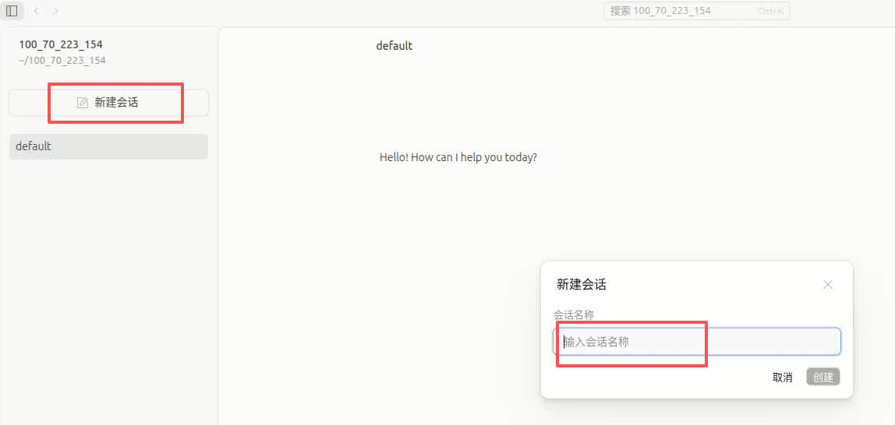
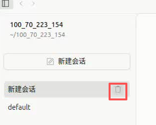
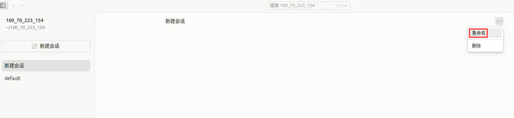
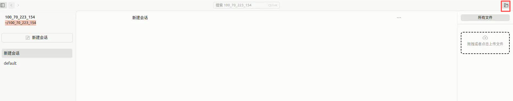
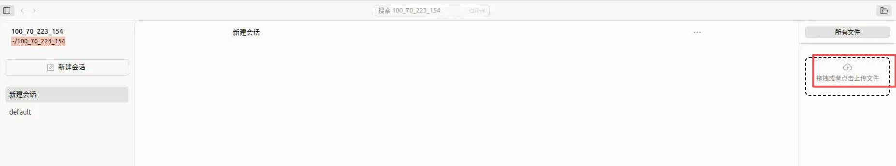
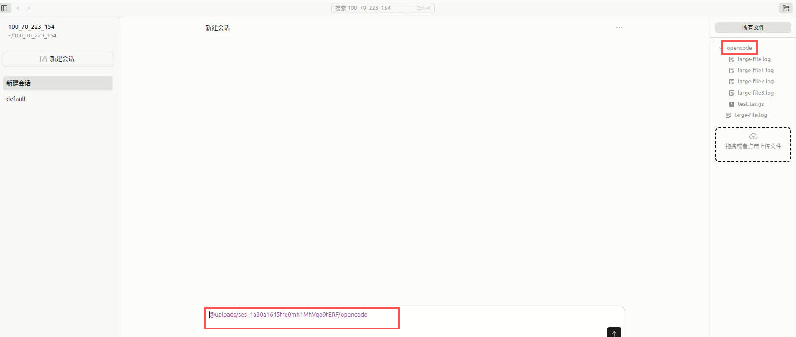
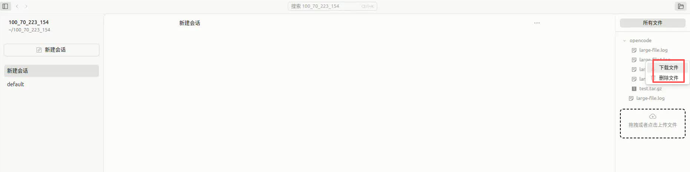
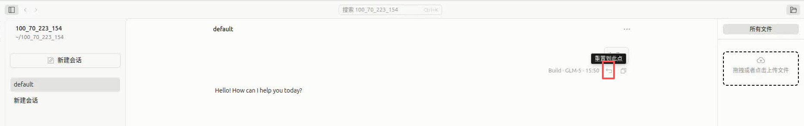

# OpenCode Web 多用户共享界面使用指南

## 概述

OpenCode Web 提供了多用户共享访问的 Web 界面，支持通过浏览器远程访问和操作项目。本文档介绍 Web 界面的主要功能和使用方法。

## 0. 访问方式

通过浏览器访问：
- **本地开发**：`http://localhost:3000`
- **局域网访问**：`http://{服务器IP}:3000`

## 1. 会话管理

### 1.1 界面布局

左侧侧边栏包含：
- **项目列表**：显示操作的项目，点击图标可快速切换项目
- **会话列表**：显示当前项目下的会话，默认显示 15 条，如果会话超过15条显示加载更多

### 1.2 新建会话

1. 点击会话列表区域的 **"新建会话"** 按钮
2. 在弹出的对话框中输入会话名称
3. 点击确认后自动进入新会话

### 1.3 删除会话

1. 在会话列表中找到要删除的会话
2. 鼠标悬停显示删除按钮（垃圾桶图标）
3. 点击后确认删除

**注意**：删除操作为永久删除，无法恢复，请谨慎操作。

### 1.4 会话重命名

1. 点击右上角三点菜单
2. 选择 **"重命名"**
3. 输入新的会话名称
4. 按回车确认

### 1.5 自动会话

进入项目时如果没有指定会话 ID，系统会自动打开最近的会话，或创建一个名为 "default" 的默认会话。

## 2. 文件树切换

文件树默认打开，显示当前项目上传文件目录（$projectPath/upload/session-id/）的文件结构。

### 切换方式

- **关闭/打开**：点击会话标题栏右侧的文件树图标

### 自动行为

- 访问他人的项目时，文件树会自动关闭

## 3. 文件操作

### 3.1 上传文件

**点击上传：**
1. 点击文件树底部 **"拖拽或点击上传文件"** 区域
2. 选择要上传的文件或文件夹
3. 文件自动上传到当前项目目录

**拖拽上传：**
1. 直接将文件或文件夹拖拽到上传区域
2. 支持文件夹上传，自动保持原有目录结构

### 3.2 引用文件

在对话中引用文件：
1. 双击文件树一级目录自动把文件引用到输入框中

### 3.3 删除/下载文件

1. 在文件树中右键点击文件
2. 选择 **"删除文件"** 或 **"下载文件"** 选项
3. 确认删除操作

**权限限制**：仅自己的项目可删除文件，所有项目都支持下载文件

## 4. 权限管理

### 4.1 项目权限规则

| 功能    | 自己的项目 | 他人的项目 |
|-------|-----------|-----------|
| 发送消息  | ✅ | ❌ |
| 创建会话  | ✅ | ❌ |
| 删除会话  | ✅ | ❌ |
| 会话重命名 | ✅ | ❌ |
| 上传文件  | ✅ | ❌ |
| 删除文件  | ✅ | ❌ |
| 下载文件  | ✅ | ✅ |
| 查看会话  | ✅ | ✅ |

### 4.2 项目识别

系统通过客户端 IP 地址识别项目归属：
- 每个 IP 对应一个独立的项目目录
- 用户只能对自己的项目进行写操作

## 5. 重置到此点

### 5.1 使用场景

当会话出现以下情况时，可使用"重置到此点"功能：
- AI 响应出现错误或偏离预期
- 需要回到之前的某个决策点重新开始
- 清理无用的会话分支

### 5.2 操作方法

1. 在消息时间线中找到要重置的消息
2. 点击消息右侧的 **"重置到此点"** 按钮
3. 系统会删除该消息之后的所有内容
4. 会话回到该消息时的状态

## 6. 文件隔离机制

不同用户的会话数据存储在独立的项目目录中，实现完全隔离：
- 每个用户通过 IP 地址自动识别并分配独立目录
- 用户之间数据互不干扰，无法访问他人的私有数据
- 上传的文件仅在自己项目中可见

## 7. 其他功能

### 7.1 搜索会话

1. 按 `Cmd+K` 或 `Ctrl+K` 打开搜索框
2. 输入会话名称关键词
3. 点击搜索结果跳转到对应会话

**无输入时**：显示快捷操作（上一个会话、下一个会话等）

### 7.2 快捷键

| 快捷键 | 功能 |
|--------|------|
| `Ctrl/Cmd + K` | 打开搜索面板 |

### 7.3 多用户访问

系统支持多用户同时访问：
- 每个用户通过 IP 自动识别
- 用户之间数据隔离
- 可查看其他用户的会话但不能修改

### 7.4 支持一键复制结果

系统提供多种复制功能：

**复制 AI 回复内容：**
- 点击消息下方的复制图标，一键复制完整回复内容

## 8. 常见问题

### Q: 为什么文件树自动关闭？

A: 当访问非自己的项目时，文件树会自动关闭以防止误操作。切换回自己的项目后可重新打开。

### Q: 如何查看历史会话？

A: 会话列表默认显示最近 15 条，点击"加载更多"查看更多历史会话。

### Q: 删除的会话能恢复吗？

A: 删除操作是永久删除，无法恢复。请谨慎操作。

### Q: 为什么有些功能按钮禁用？

A: 禁用的按钮表示当前用户没有权限（如非自己的项目）。

### Q: 如何上传文件夹？

A: 直接拖拽整个文件夹到文件树底部上传区域，系统会自动保持目录结构。

